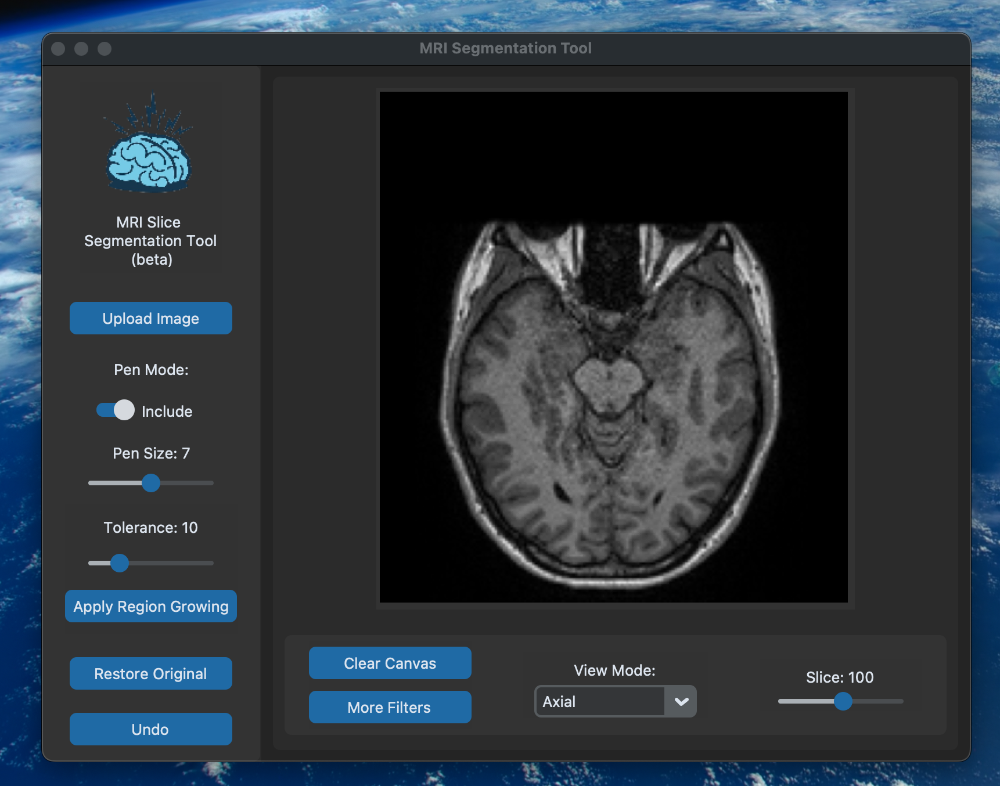

# MRI analyzer
 MRI scans segmentation tool(beta)


# MRI Segmentation Tool

This tool is designed for MRI Slice Segmentation. It provides a user interface for uploading an MRI image, drawing annotations on it, and processing the segmentation.

## Installation

Ensure you have Python 3.x installed on your system.

First create a virtual enviroment where to install all the dependencies for this Python application using:

```bash
virtualenv venv
```

Then activate the Virtual enviroment you just created with:

```bash
source venv/bin/activate
```

Then clone this repository, navigate to the directory where requirements.txt lives, and install the dependencies using:

```bash
pip install -r requirements.txt
```

## Usage

Run the script using:

```bash
python3 main.py
```

Upon running the script, a GUI window will open. Follow the instructions on the GUI to perform segmentation.

## Features

- Upload an image for segmentation.(preferably an MRI scan)
- Draw annotations with customizable pen size and color.
- Clear selections.
- Process segmentation.

## Screenshots

when you open the app, the first window should look like this:


select the MRI image in .nii format like so:


now the first print of your file should appear along with the tools and options for you to tweak it


you have many options, segmenting a visualizing options, along with a slider to see each and every slice of your 3d image




for applying the segmentation, first we use the pencil tool to highlight the region of interest (green color), and the avoid region (red color)


after drawing your selection, hit the "apply segmentation" button to start the Region Growing segmentation:


you can apply other filters before the segmentation, feel free to play with the parameters in the filters window!


## Dependencies

- `customtkinter`: A custom module for enhanced GUI elements.
- `tkinter`: Standard Python interface to the Tk GUI toolkit.
- `PIL`: Python Imaging Library to work with images.

## Contributing

Contributions are welcome! Please open an issue to discuss potential changes/additions.

## License

This project is licensed under the [Universidad del Valle] 2024