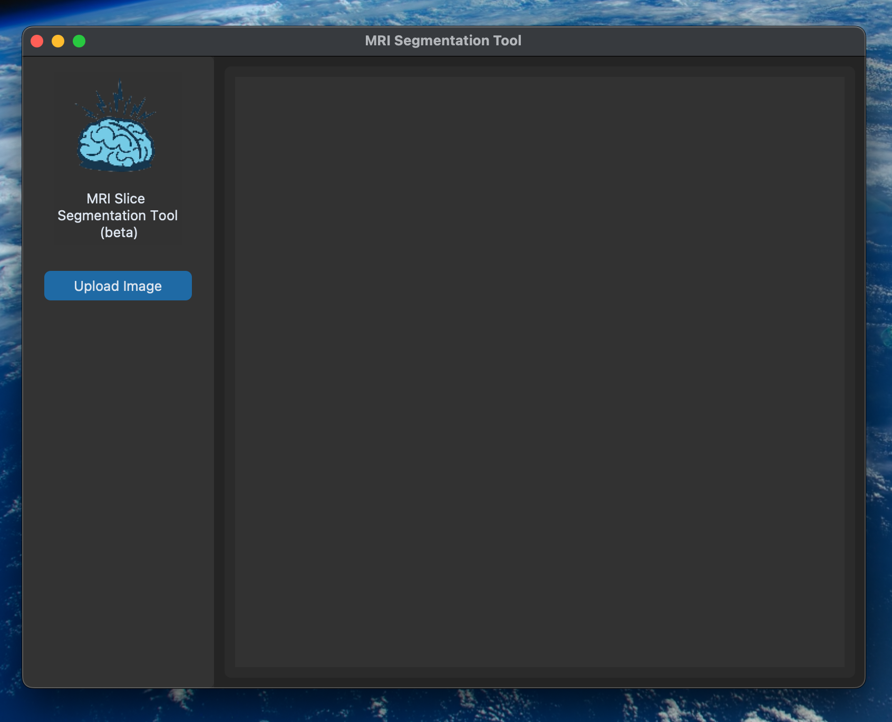
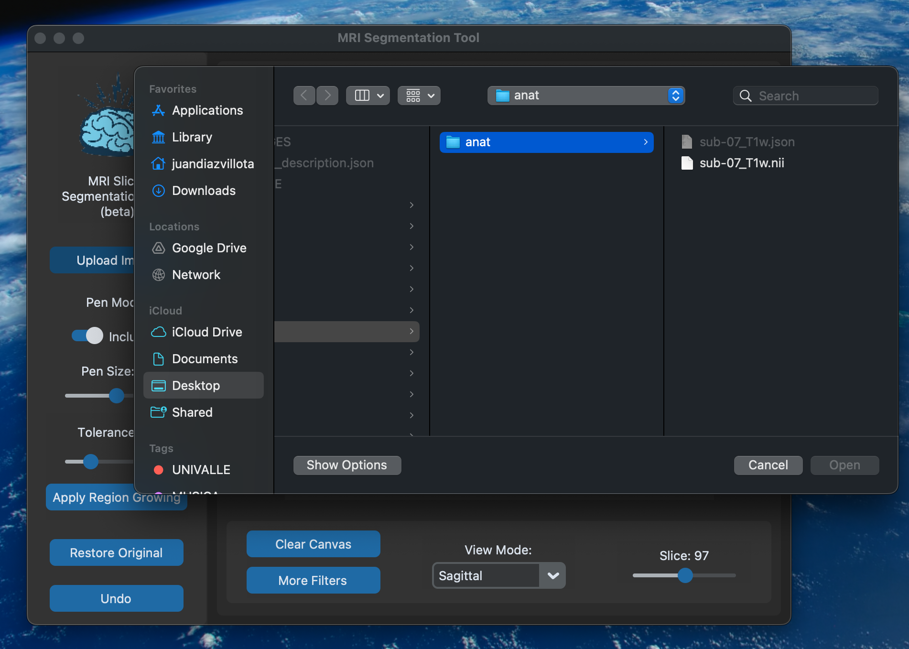
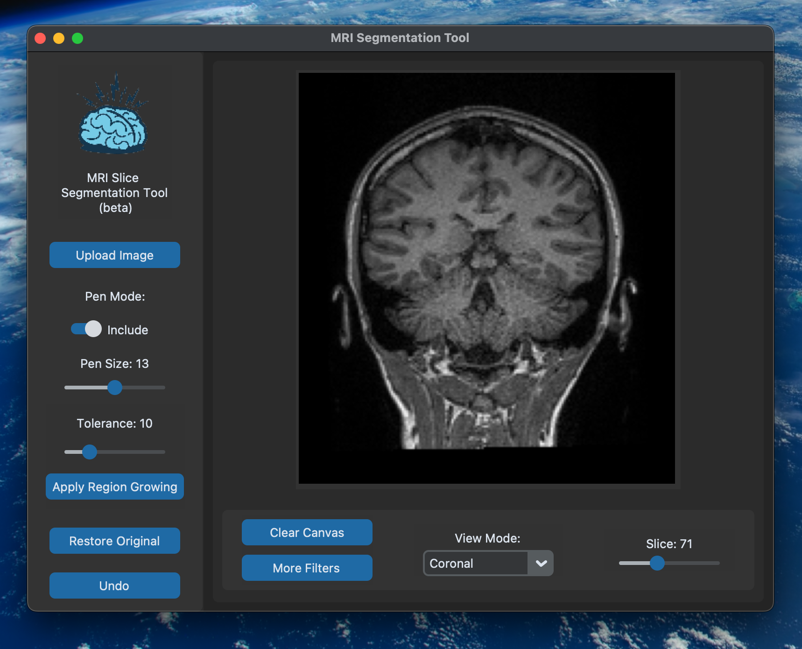
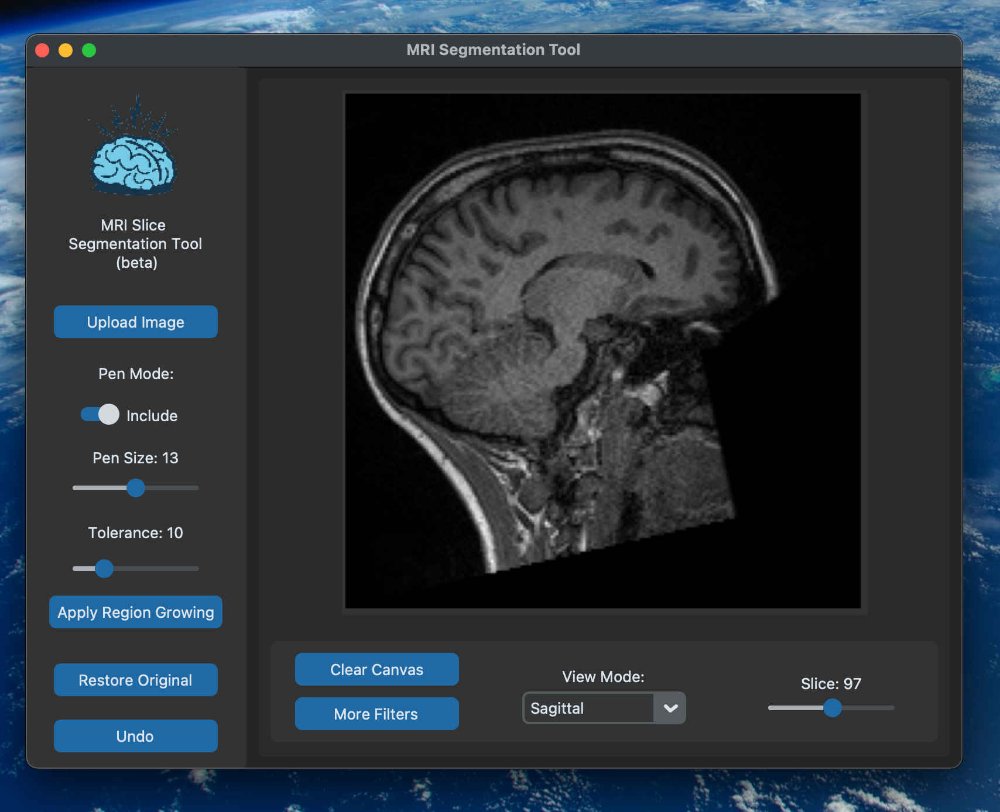
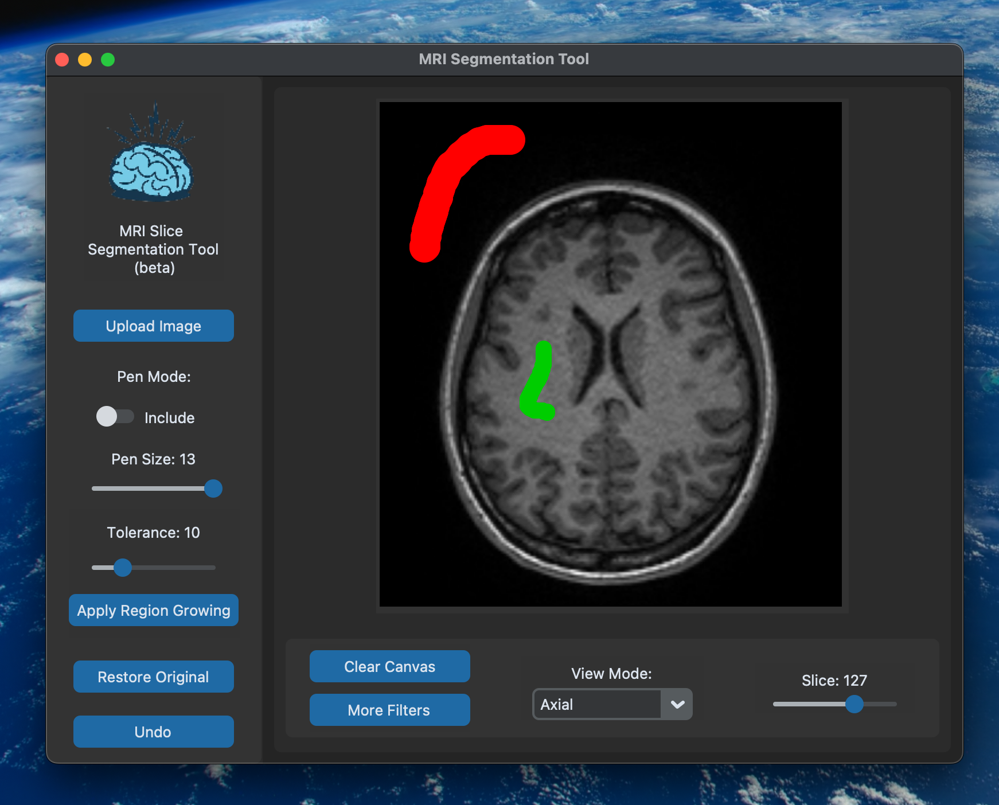
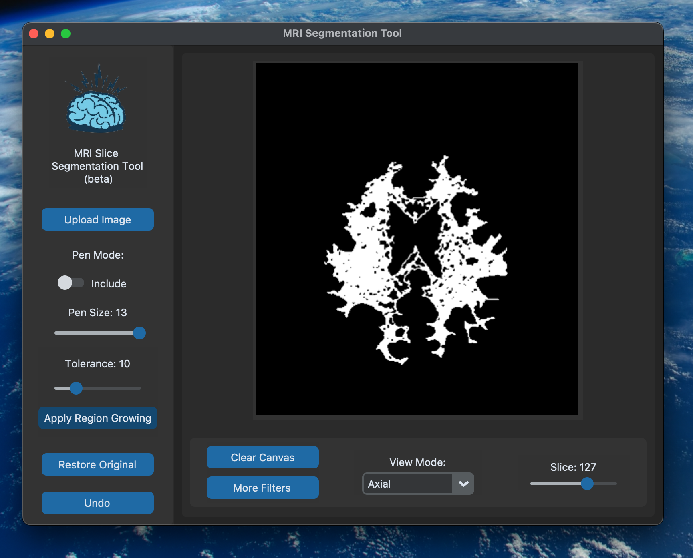
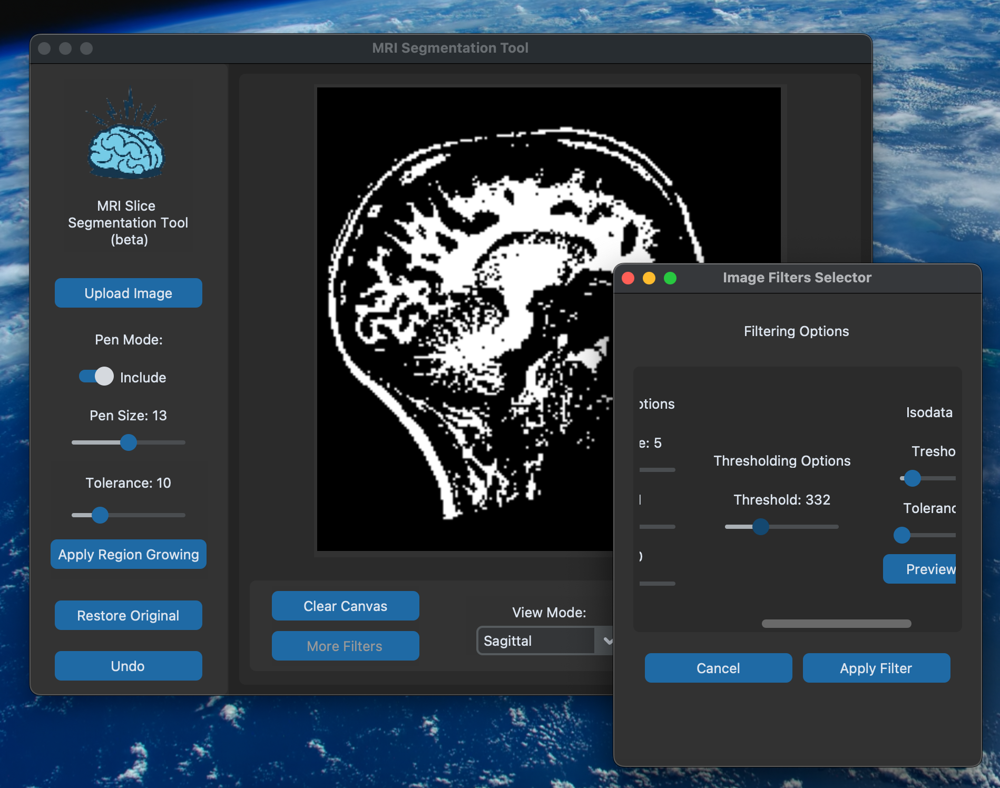

# MRI analyzer
 MRI scans segmentation tool(beta)


# MRI Segmentation Tool

This tool is designed for MRI Slice Segmentation. It provides a user interface for uploading an MRI image, drawing annotations on it, and processing the segmentation.

## Installation

Ensure you have Python 3.x installed on your system.

First create a virtual enviroment where to install all the dependencies for this Python application using:

```bash
virtualenv venv
```

Then activate the Virtual enviroment you just created with:

```bash
source venv/bin/activate
```

Then clone this repository, navigate to the directory where requirements.txt lives, and install the dependencies using:

```bash
pip install -r requirements.txt
```

## Usage

Run the script using:

```bash
python3 main.py
```

Upon running the script, a GUI window will open. Follow the instructions on the GUI to perform segmentation.

## Features

- Upload an image for segmentation.(preferably an MRI scan)
- Draw annotations with customizable pen size and color.
- Clear selections.
- Process segmentation.

## Screenshots

Upon opening the app, the initial window should resemble the following:




Next, select an MRI image in .nii format as shown:



Once the image loads, the interface will display the first slice of your file along with tools and options for customization:




The interface offers various options, including different filters and visualization tools, along with a slider to navigate through each slice of your 3D image:




To apply segmentation, first utilize the pencil tool to highlight the region of interest (marked in green) and the areas to avoid (marked in red):




Once the selection is made, click the "Apply Region Growing" button to initiate the Region Growing segmentation process:




You can apply additional filters before segmentation; feel free to experiment with the filter parameters in the filters window:




## Dependencies

- `customtkinter`: A custom module for enhanced GUI elements.
- `tkinter`: Standard Python interface to the Tk GUI toolkit.
- `PIL`: Python Imaging Library to work with images.

## Contributing

Contributions are welcome! Please open an issue to discuss potential changes/additions.

## License

This project is licensed under the [Universidad del Valle] 2024